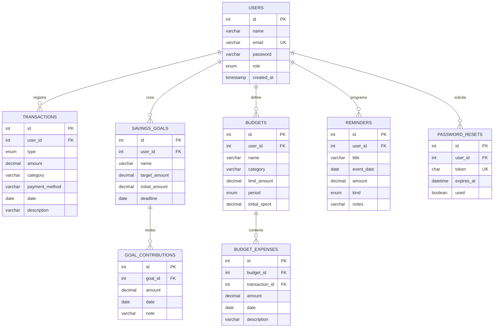

# MER — Cashly

## Relaciones principales
- Un usuario puede registrar muchos movimientos.
- Un usuario puede tener muchas metas; cada meta puede tener muchos abonos.
- Un usuario puede tener muchos presupuestos; cada presupuesto puede tener muchos gastos.
- Un usuario puede crear muchos recordatorios.
- Un usuario puede solicitar varios tokens de recuperación; cada token pertenece a un usuario.
